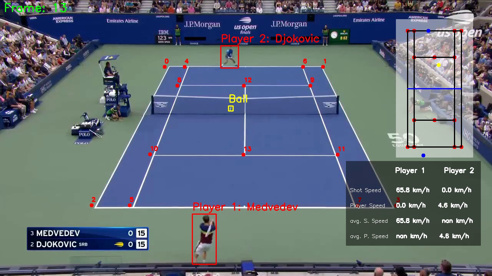

# Tennis Match Analysis with Computer Vision

## Overview

This repository contains the codebase for a comprehensive computer vision project designed for analyzing tennis matches. Leveraging advanced techniques and models, the system offers multi-faceted insights into gameplay dynamics, player movements, and ball trajectories.

## Key Features

- **YOLOv8 Player Detection:** Utilizes YOLOv8 for robust player detection within tennis match footage, enabling precise tracking of player movements throughout the match.
  
- **Fine-Tuning for Ball Detection:** Fine-tunes YOLO model to accurately detect the tennis ball in varying conditions, ensuring consistent tracking and analysis of ball trajectories.
  
- **Speed Detection:** Implements algorithms to calculate the speed of both players and the ball, providing valuable metrics for performance evaluation and tactical analysis.
  
- **Mini Court Generation:** Dynamically generates a miniature representation of the tennis court, reflecting the actual positions and movements of players during the match for intuitive visualization.
  
- **Key Point Extraction:** Fine-tunes the last layer of ResNet50 on a custom dataset to extract keypoints on the court, facilitating advanced spatial analysis and strategic insights.

## Usage

1. **Installation:**
   - Clone this repository to your local machine.
   - Install the required dependencies using `pip install -r requirements.txt`.
   
2. **Running the System:**
   - Add your tennis match video in the .mp4 format inside the input_video folder.
   - Run the main script to perform player detection, ball detection, speed calculation, mini court generation, and key point extraction.
   
3. **Customization:**
   - Modify the configurations and parameters in the scripts to tailor the analysis to your specific requirements.
   - Fine-tune models on additional datasets for improved performance in different conditions.
   

## Contributions

Contributions, bug fixes, and feature enhancements are welcomed through pull requests. 
